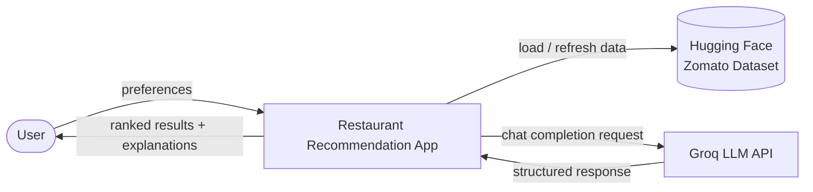
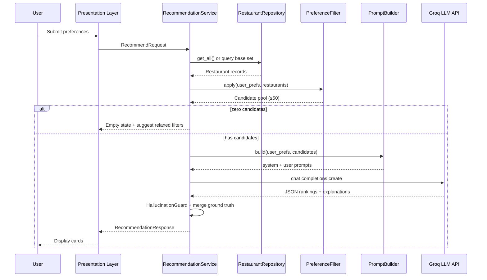

# Architecture: AI-Powered Restaurant Recommendation System

This document defines the technical architecture for the Zomato-inspired restaurant recommendation service described in [`context.md`](../context.md) and [`problemstatement.txt`](problemstatement.txt).

---

## 1. Architectural Goals

| Goal | Description |
|------|-------------|
| **Grounded recommendations** | Every suggestion must map to a real record in the Zomato Hugging Face dataset — no hallucinated restaurants. |
| **Hybrid intelligence** | Use deterministic filtering for hard constraints; delegate ranking and natural-language explanations to the LLM. |
| **Transparency** | Users see *why* each restaurant was recommended, not only names and scores. |
| **Simplicity** | A single deployable application with clear module boundaries, suitable for a milestone/demo build. |
| **Extensibility** | Layers are decoupled so the UI or dataset source can be swapped without rewriting core logic; the LLM client wraps Groq behind a thin interface. |

---

## 2. System Context

The system sits between a **user** (submitting dining preferences) and two external dependencies:

1. **Hugging Face Dataset** — `ManikaSaini/zomato-restaurant-recommendation`
2. **Groq LLM API** — [GroqCloud](https://console.groq.com) for fast inference (ranking and natural-language explanations)



---

## 3. Layered Architecture

The application is organized into five logical layers that mirror the workflow in `context.md`.

```
┌─────────────────────────────────────────────────────────────────────────┐
│                        PRESENTATION LAYER                               │
│  UI / CLI — forms, validation, results cards, loading & error states    │
└─────────────────────────────────────────────────────────────────────────┘
                                    │
                                    ▼
┌─────────────────────────────────────────────────────────────────────────┐
│                        APPLICATION LAYER                                │
│  Recommendation Orchestrator — coordinates end-to-end request lifecycle │
└─────────────────────────────────────────────────────────────────────────┘
          │                    │                         │
          ▼                    ▼                         ▼
┌──────────────────┐ ┌──────────────────┐ ┌──────────────────────────────┐
│  DATA LAYER      │ │ INTEGRATION LAYER│ │  RECOMMENDATION ENGINE       │
│  Ingestion +     │ │ Filter + Prompt  │ │  Groq client + response parse │
│  local store     │ │ Builder          │ │  + validation                │
└──────────────────┘ └──────────────────┘ └──────────────────────────────┘
          │
          ▼
┌──────────────────┐
│  EXTERNAL DATA   │
│  Hugging Face    │
└──────────────────┘
```

### Layer Responsibilities

| Layer | Modules | Responsibility |
|-------|---------|----------------|
| **Presentation** | `UserInputForm`, `ResultsView` | Collect preferences, display top-N recommendations with explanations |
| **Application** | `RecommendationService` | Single entry point: validate input → filter → prompt → Groq → format output |
| **Data** | `DatasetLoader`, `DataPreprocessor`, `RestaurantRepository` | Load HF dataset, normalize fields, expose query/filter interface |
| **Integration** | `PreferenceFilter`, `PromptBuilder`, `ContextFormatter` | Apply hard filters; serialize candidates for the LLM |
| **Recommendation Engine** | `GroqClient`, `ResponseParser`, `HallucinationGuard` | Call Groq chat completions, parse ranked output, verify restaurant IDs/names exist in filtered set |

---

## 4. Component Design

### 4.1 Data Ingestion (`Data Layer`)

**Purpose:** Load the Zomato dataset once (or on schedule), clean it, and make it queryable in memory or a lightweight store.

#### Pipeline

```
Hugging Face API
      │
      ▼
┌─────────────┐    ┌──────────────┐    ┌─────────────┐    ┌────────────────┐
│ Raw Load    │ ─► │ Normalize    │ ─► │ Validate    │ ─► │ Index / Cache  │
│ (datasets   │    │ (types,      │    │ (drop bad   │    │ (in-memory DF, │
│  library)   │    │  casing)     │    │  rows)      │    │  SQLite, etc.) │
└─────────────┘    └──────────────┘    └─────────────┘    └────────────────┘
```

#### Canonical Restaurant Record

After preprocessing, each record should conform to a normalized schema:

| Field | Type | Source / Notes |
|-------|------|----------------|
| `id` | string | Stable identifier (dataset index or derived hash) |
| `name` | string | Restaurant name |
| `location` | string | City / locality (normalized, e.g., `"Bangalore"`) |
| `cuisines` | list[string] | Split multi-cuisine strings (e.g., `"North Indian, Chinese"`) |
| `rating` | float | Numeric rating; invalid values → `null` or excluded |
| `cost_for_two` | int \| null | Estimated cost in local currency |
| `budget_tier` | enum | Derived: `low` \| `medium` \| `high` from cost percentiles or ranges |
| `raw_metadata` | object | Optional extra columns preserved for LLM context |

#### Preprocessing Rules

- **Location:** Trim whitespace, title-case city names, map aliases if needed (e.g., `"Bengaluru"` → `"Bangalore"`).
- **Cuisine:** Lowercase for matching; preserve display casing for output.
- **Rating:** Parse to float; filter or flag rows below usable thresholds.
- **Cost:** Parse numeric cost; assign `budget_tier` using dataset-wide quartiles or fixed bands (configurable).
- **Deduplication:** Remove exact duplicate name+location rows if present.

#### Storage Options (choose one for implementation)

| Option | Pros | Cons |
|--------|------|------|
| **In-memory DataFrame** | Fastest for demo; zero infra | Reload on restart |
| **SQLite / Parquet file** | Persists between runs; still simple | Slightly more setup |
| **Vector DB** | Useful if semantic search is added later | Overkill for milestone scope |

**Recommended for milestone:** In-memory DataFrame loaded at startup, with optional Parquet cache to avoid re-downloading.

---

### 4.2 User Input (`Presentation Layer`)

**Purpose:** Capture structured preferences and optional free-text constraints.

#### Input Schema

```json
{
  "location": "Bangalore",
  "budget": "medium",
  "cuisine": "Italian",
  "min_rating": 4.0,
  "additional_preferences": "family-friendly, quick service",
  "top_n": 5
}
```

| Field | Required | Validation |
|-------|----------|------------|
| `location` | Yes | Non-empty; must match or fuzzy-match a known city in dataset |
| `budget` | Yes | One of: `low`, `medium`, `high` |
| `cuisine` | No | String; partial match against `cuisines` list |
| `min_rating` | No | Float 0–5; default e.g. `3.5` |
| `additional_preferences` | No | Free text passed through to LLM prompt |
| `top_n` | No | Integer 1–10; default `5` |

#### Validation Strategy

1. **Client-side:** Immediate feedback on missing required fields and invalid enums.
2. **Server-side:** Re-validate before filtering; return `400` with clear messages for invalid location or budget.

---

### 4.3 Integration Layer

**Purpose:** Bridge structured data and the LLM — filter candidates, then build a prompt the model can reason over.

#### 4.3.1 Preference Filter (`PreferenceFilter`)

Applies **hard constraints** before the LLM sees any data. This reduces token usage and prevents the model from recommending out-of-scope restaurants.

```
All Restaurants
      │
      ▼ filter by location (exact or case-insensitive)
      ▼ filter by min_rating (rating >= threshold)
      ▼ filter by budget_tier (match user budget)
      ▼ filter by cuisine (substring / any-match in cuisines list)
      │
      ▼
Candidate Pool (max M records, e.g. 20–50)
```

| Filter | Logic |
|--------|-------|
| Location | `restaurant.location.lower() == user.location.lower()` |
| Min rating | `restaurant.rating >= user.min_rating` (skip if rating is null) |
| Budget | `restaurant.budget_tier == user.budget` |
| Cuisine | Any cuisine in list contains user cuisine (case-insensitive) |

**Fallback behavior:**

- If **zero** candidates: relax least important filter (e.g., cuisine) and notify user in summary.
- If **too many** candidates (>50): sort by rating descending, take top 50 before prompting.

#### 4.3.2 Context Formatter (`ContextFormatter`)

Serializes the candidate pool into a compact, LLM-friendly structure:

```json
[
  {
    "id": "r_1042",
    "name": "Truffles",
    "location": "Bangalore",
    "cuisines": ["American", "Italian"],
    "rating": 4.6,
    "cost_for_two": 1600,
    "budget_tier": "medium"
  }
]
```

Keep token count low: omit redundant fields, cap list length, use short keys in prompt.

#### 4.3.3 Prompt Builder (`PromptBuilder`)

Constructs a **system + user** prompt pair.

**System prompt (role & rules):**

- You are a restaurant recommendation assistant.
- Only recommend restaurants from the provided JSON list.
- Do not invent restaurants or attributes not present in the data.
- Rank by fit to user preferences; explain each pick in 1–2 sentences.
- Return **valid JSON** matching the output schema.

**User prompt (context):**

- User preferences (structured)
- Candidate restaurant JSON array
- Instruction: return top N with rank, explanation, and optional overall summary

---

### 4.4 Recommendation Engine (`LLM Layer`)

**Purpose:** Invoke **Groq** for chat completions, parse the response, and enforce grounding.

#### Groq Integration

The project uses the official **[Groq Python SDK](https://github.com/groq/groq-python)** (`groq` package) to call GroqCloud's OpenAI-compatible Chat Completions API.

| Setting | Value |
|---------|-------|
| **SDK** | `groq` (`pip install groq`) |
| **Client** | `Groq(api_key=os.environ["GROQ_API_KEY"])` |
| **API method** | `client.chat.completions.create(...)` |
| **Default model** | `llama-3.3-70b-versatile` (override via `GROQ_MODEL`) |
| **Alternate models** | `llama-3.1-8b-instant`, `mixtral-8x7b-32768` |
| **Auth** | `GROQ_API_KEY` from [Groq Console](https://console.groq.com/keys) |

**Example call (conceptual):**

```python
from groq import Groq

client = Groq(api_key=settings.groq_api_key)
response = client.chat.completions.create(
    model=settings.groq_model,
    messages=[
        {"role": "system", "content": system_prompt},
        {"role": "user", "content": user_prompt},
    ],
    temperature=0.3,
    max_tokens=1024,
    response_format={"type": "json_object"},  # when supported by chosen model
)
```

Groq's low-latency inference keeps end-to-end recommendation latency within the project target (< 5s), including filtering and response parsing.

#### Request Flow

```
PromptBuilder output
        │
        ▼
┌───────────────┐
│  GroqClient   │  temperature: low (0.2–0.5) for consistent ranking
│  (Groq API)   │  max_tokens: sized for top_n explanations
└───────────────┘
        │
        ▼
┌───────────────┐
│ ResponseParser│  extract JSON; handle markdown fences
└───────────────┘
        │
        ▼
┌───────────────────┐
│ HallucinationGuard│  verify each id/name ∈ candidate pool
└───────────────────┘
        │
        ▼
Ranked Recommendation[]
```

#### Expected LLM Output Schema

```json
{
  "summary": "Based on your preference for Italian food in Bangalore with a medium budget, here are the best matches.",
  "recommendations": [
    {
      "rank": 1,
      "restaurant_id": "r_1042",
      "name": "Truffles",
      "explanation": "Highly rated Italian-American spot within your budget, popular for family dining."
    }
  ]
}
```

#### Hallucination Guard

For each LLM recommendation:

1. Resolve `restaurant_id` or `name` against the candidate pool.
2. If not found, **drop** the entry or replace with the next valid ranked item from a fallback (e.g., sort candidates by rating).
3. Merge LLM explanation with **ground-truth** fields (`cuisine`, `rating`, `cost_for_two`) from the dataset — never trust the LLM for numeric facts.

#### Retry Policy

| Failure | Action |
|---------|--------|
| Invalid JSON | Retry once with “return only valid JSON” reminder |
| Empty recommendations | Fall back to rating-sorted top N with template explanations |
| Groq API timeout / rate limit | Retry once with backoff → filter-only fallback |
| All hallucinated | Discard LLM output; use deterministic ranking fallback |

---

### 4.5 Output Display (`Presentation Layer`)

**Purpose:** Render human-readable results using grounded data + LLM explanations.

#### Response DTO (API / UI)

```json
{
  "query": { "location": "Bangalore", "budget": "medium", "cuisine": "Italian", "min_rating": 4.0 },
  "summary": "Based on your preference for Italian food...",
  "recommendations": [
    {
      "rank": 1,
      "name": "Truffles",
      "cuisine": "American, Italian",
      "rating": 4.6,
      "estimated_cost": 1600,
      "explanation": "Highly rated Italian-American spot within your budget..."
    }
  ],
  "meta": {
    "candidates_considered": 23,
    "filters_applied": ["location", "budget", "cuisine", "min_rating"]
  }
}
```

#### UI Layout (conceptual)

```
┌────────────────────────────────────────────────────────────┐
│  Find Restaurants                                          │
│  Location [____]  Budget [low|medium|high]  Cuisine [____] │
│  Min Rating [____]  Other preferences [________________]   │
│                                    [ Get Recommendations ] │
└────────────────────────────────────────────────────────────┘

┌────────────────────────────────────────────────────────────┐
│  AI Summary: "Based on your preference for..."             │
└────────────────────────────────────────────────────────────┘

┌──────────────────┐  ┌──────────────────┐  ┌──────────────┐
│ #1 Truffles      │  │ #2 ...           │  │ #3 ...       │
│ ★ 4.6 · ₹1600   │  │                  │  │              │
│ Italian, American│  │                  │  │              │
│ "Highly rated..."│  │                  │  │              │
└──────────────────┘  └──────────────────┘  └──────────────┘
```

---

## 5. End-to-End Request Flow



---

## 6. Module Structure (Suggested)

```
zomato-recommendation/
├── app/
│   ├── main.py                 # Entry point (FastAPI / Streamlit / CLI)
│   ├── config.py               # Env vars, budget tiers, top_n defaults
│   │
│   ├── data/
│   │   ├── loader.py           # Hugging Face dataset download
│   │   ├── preprocessor.py     # Normalize fields, derive budget_tier
│   │   └── repository.py       # In-memory query + filter helpers
│   │
│   ├── models/
│   │   ├── restaurant.py       # Restaurant dataclass / Pydantic model
│   │   ├── user_input.py       # UserPreferences schema
│   │   └── recommendation.py   # RecommendationResponse schema
│   │
│   ├── integration/
│   │   ├── filter.py           # PreferenceFilter
│   │   ├── formatter.py      # ContextFormatter
│   │   └── prompt_builder.py   # Prompt templates
│   │
│   ├── engine/
│   │   ├── groq_client.py      # Groq SDK wrapper (chat completions)
│   │   ├── parser.py           # JSON extraction + validation
│   │   └── guard.py            # HallucinationGuard
│   │
│   └── services/
│       └── recommendation_service.py  # Orchestrator
│
├── data/
│   └── cache/                  # Optional Parquet / SQLite cache
│
├── docs/
│   ├── problemstatement.txt
│   ├── architecture.md
│   └── ...
│
├── context.md
├── requirements.txt
└── .env.example                # GROQ_API_KEY, GROQ_MODEL, etc.
```

---

## 7. Technology Recommendations

| Concern | Suggested Choice | Rationale |
|---------|------------------|-----------|
| Language | Python 3.10+ | Strong HF `datasets`, pandas, and LLM SDK support |
| Dataset loading | `datasets` + `pandas` | Native Hugging Face integration |
| API / UI | **Streamlit** (fastest demo) or **FastAPI + React** | Streamlit for milestone; FastAPI if API-first |
| LLM access | **Groq Python SDK** (`groq`) | Fast inference via GroqCloud; OpenAI-compatible chat API |
| Validation | Pydantic v2 | Typed request/response models |
| Config | `python-dotenv` | Keep API keys out of source |

---

## 8. Configuration

| Variable | Description | Example |
|----------|-------------|---------|
| `HF_DATASET_NAME` | Hugging Face dataset id | `ManikaSaini/zomato-restaurant-recommendation` |
| `GROQ_API_KEY` | Groq API secret | *(env only, never committed)* |
| `GROQ_MODEL` | Groq model id | `llama-3.3-70b-versatile` |
| `GROQ_TEMPERATURE` | Sampling temperature | `0.3` |
| `GROQ_MAX_TOKENS` | Max completion tokens | `1024` |
| `MAX_CANDIDATES` | Cap before LLM prompt | `50` |
| `DEFAULT_TOP_N` | Default recommendations count | `5` |
| `BUDGET_LOW_MAX` | Cost upper bound for `low` tier | Dataset-specific |
| `BUDGET_MEDIUM_MAX` | Cost upper bound for `medium` tier | Dataset-specific |

---

## 9. Non-Functional Requirements

| Category | Target |
|----------|--------|
| **Latency** | < 5s end-to-end for typical candidate pool (Groq's fast inference helps meet this) |
| **Availability** | Graceful degradation: filter-only fallback if Groq API unavailable |
| **Scalability** | Single-user / demo scale; in-memory dataset sufficient |
| **Maintainability** | Clear layer boundaries; `GroqClient` isolated in the engine layer |
| **Observability** | Log filter counts, prompt token size, Groq latency, guard rejections |

---

## 10. Security & Privacy

- Store `GROQ_API_KEY` in environment variables only; never in repo.
- Do not log full prompts containing user free-text at production log levels (or redact).
- Validate and sanitize all user inputs to prevent prompt injection — treat `additional_preferences` as untrusted text; instruct the model to ignore instructions embedded in user text that conflict with system rules.
- No PII storage required for milestone scope; user queries are ephemeral per session.

---

## 11. Error Handling Matrix

| Scenario | HTTP / UI Behavior | User Message |
|----------|-------------------|--------------|
| Invalid location | 400 / inline error | "Location not found in dataset. Try Delhi, Bangalore, ..." |
| No matches after filters | 200 with empty list | "No restaurants match. Try relaxing cuisine or rating." |
| LLM invalid JSON | Retry → fallback | Results shown with note: "AI ranking unavailable; sorted by rating." |
| Dataset load failure | 503 | "Unable to load restaurant data. Please try again later." |
| Missing `GROQ_API_KEY` | 500 on startup | "Groq API key not configured." |
| Groq rate limit (429) | Retry → fallback | Results shown with note: "AI ranking temporarily unavailable." |

---

## 12. Testing Strategy

| Level | What to Test |
|-------|--------------|
| **Unit** | `PreferenceFilter` with edge cases (zero results, cuisine partial match) |
| **Unit** | `Preprocessor` field parsing and `budget_tier` assignment |
| **Unit** | `HallucinationGuard` rejects unknown restaurant IDs |
| **Unit** | `ResponseParser` handles fenced JSON and malformed output |
| **Integration** | Full pipeline with mocked `GroqClient` returning fixed JSON |
| **Manual** | End-to-end query for Delhi + low budget + Chinese, verify grounded output |

---

## 13. Future Extensions (Out of Current Scope)

- Semantic search over reviews or descriptions (embeddings + vector DB)
- User accounts and saved preference profiles
- Geospatial distance filtering (lat/long)
- A/B testing different prompt templates
- Caching LLM responses for identical preference hashes
- Multi-city comparison and “similar restaurants” suggestions

---

## 14. Architecture Decision Summary

| Decision | Choice | Reason |
|----------|--------|--------|
| LLM provider | **Groq** (GroqCloud) | Fast, cost-effective inference for ranking and explanations |
| Ranking authority | Groq LLM with deterministic fallback | Combines reasoning with reliability |
| Fact source of truth | Dataset only | Prevents hallucinated ratings/costs |
| Pre-LLM filtering | Hard filters on structured fields | Reduces tokens and improves relevance |
| Candidate cap | ≤ 50 restaurants per prompt | Controls cost and latency |
| Output format | Structured JSON from LLM → merged DTO | Machine-parseable and UI-friendly |

---

## 15. References

- Project context: [`context.md`](../context.md)
- Problem statement: [`problemstatement.txt`](problemstatement.txt)
- Dataset: [ManikaSaini/zomato-restaurant-recommendation](https://huggingface.co/datasets/ManikaSaini/zomato-restaurant-recommendation)
- LLM: [Groq Documentation](https://console.groq.com/docs/overview)
- Groq Python SDK: [groq/groq-python](https://github.com/groq/groq-python)
