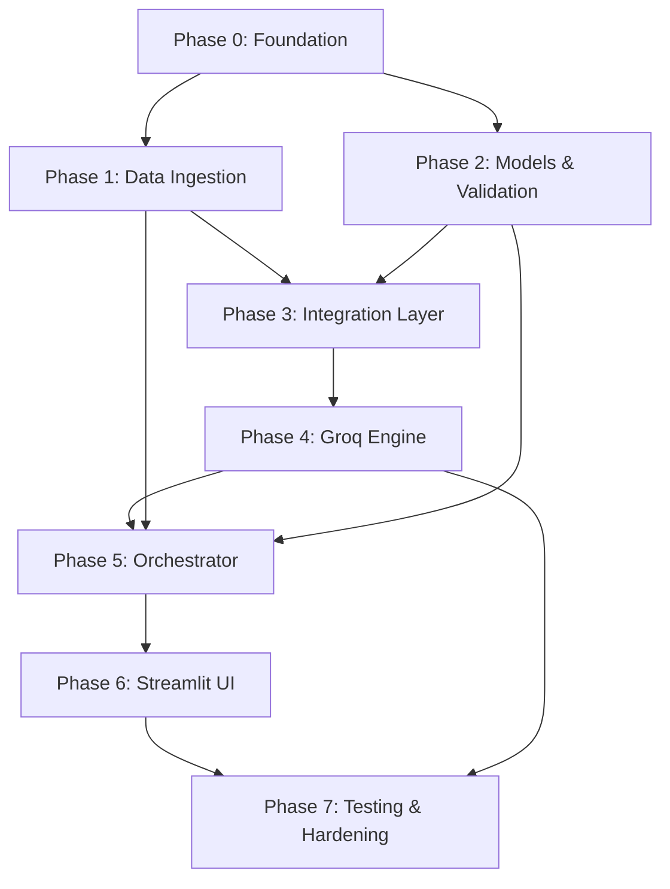

# Phase-Wise Implementation Plan

This document defines a step-by-step build plan for the **AI-Powered Restaurant Recommendation System**, derived from [`context.md`](../context.md) and [`architecture.md`](architecture.md).

---

## 1. Plan Overview

### 1.1 Goal

Deliver a working Zomato-inspired recommendation app that:

1. Loads real restaurant data from Hugging Face
2. Accepts user preferences (location, budget, cuisine, rating, extras)
3. Filters candidates deterministically, then ranks and explains via **Groq**
4. Displays top-N grounded recommendations with AI explanations

### 1.2 Implementation Strategy

Build bottom-up, divided into two distinct tracks: **Backend Development** and **Premium Frontend Presentation**:

#### Part A: Backend Development Track
- **Phase 0:** Project Foundation & Scaffolding
- **Phase 1:** Data Ingestion & Clean In-Memory Repository
- **Phase 2:** Models & Typed Schema Validation
- **Phase 3:** Integration Filtering & Prompt Engineering
- **Phase 4:** Groq LLM Recommendation Engine
- **Phase 5:** Application Orchestrator

#### Part B: Desktop Web-First Frontend Presentation Track
> **Target:** 1440px laptop/desktop browser — no mobile breakpoints required.
- **Phase 6:** High-Quality Streamlit UI Foundation — Desktop Two-Column Layout (Sticky Sidebar + Scrollable Results)
- **Phase 7:** Custom CSS Styling, Glassmorphic HTML Card Components & Desktop UX Polish
- **Phase 8:** Testing, Error Matrix Verification & Hardening

---

### 1.3 Technology Stack (Locked)

| Layer | Choice |
|-------|--------|
| Language | Python 3.10+ |
| Data | `datasets`, `pandas` |
| LLM | Groq (`groq` SDK, `llama-3.3-70b-versatile`) |
| Validation | Pydantic v2 |
| UI | Streamlit (Enhanced with custom HTML/CSS cards, desktop-first 1440px layout) |
| Config | `python-dotenv` |

### 1.4 Phase Summary

| Phase | Name | Est. Duration | Primary Output |
|-------|------|---------------|----------------|
| **0** | Project Foundation | 0.5 day | Repo scaffold, deps, config |
| **1** | Data Ingestion | 1 day | Clean in-memory restaurant dataset |
| **2** | Models & Input Validation | 0.5 day | Typed schemas + validation rules |
| **3** | Integration Layer | 1 day | Filtered candidates + Groq prompts |
| **4** | Groq Recommendation Engine | 1 day | Ranked, grounded recommendations |
| **5** | Application Orchestrator | 0.5 day | End-to-end service (no UI) |
| **6** | Streamlit Desktop UI Structure | 0.5 day | Sticky left preferences panel + scrollable right results column (1440px) |
| **7** | Desktop Glassmorphic Card Layouts | 0.5 day | 3-column card grid, crimson/dark theme, lift-on-hover animations |
| **8** | Testing & Hardening | 1 day | Tests, fallbacks, polish |
| | **Total** | **~7.0 days** | Production-ready milestone demo |

---

## 2. Phase Dependency Graph



---

## Phase 0: Project Foundation

**Goal:** Establish project structure, dependencies, and configuration so all later phases share a consistent base.

**Duration:** ~0.5 day

### Tasks

- [ ] Create directory structure per `architecture.md` §6
- [ ] Add `requirements.txt` with pinned core dependencies:
  - `datasets`, `pandas`, `groq`, `pydantic`, `python-dotenv`, `streamlit`
- [ ] Create `app/config.py` — load env vars with defaults
- [ ] Create `.env.example` with:
  - `HF_DATASET_NAME`
  - `GROQ_API_KEY`
  - `GROQ_MODEL`
  - `GROQ_TEMPERATURE`
  - `GROQ_MAX_TOKENS`
  - `MAX_CANDIDATES`
  - `DEFAULT_TOP_N`
  - `BUDGET_LOW_MAX`, `BUDGET_MEDIUM_MAX`
- [ ] Add `.gitignore` (`.env`, `__pycache__`, `data/cache/`, `.venv`)
- [ ] Create empty module `__init__.py` files under `app/`, `app/data/`, `app/models/`, `app/integration/`, `app/engine/`, `app/services/`
- [ ] Obtain Groq API key from [Groq Console](https://console.groq.com/keys)

### Files to Create

```
zomato-recommendation/
├── app/
│   ├── __init__.py
│   ├── config.py
│   ├── data/__init__.py
│   ├── models/__init__.py
│   ├── integration/__init__.py
│   ├── engine/__init__.py
│   └── services/__init__.py
├── data/cache/
├── requirements.txt
├── .env.example
└── .gitignore
```

### Acceptance Criteria

- [ ] `pip install -r requirements.txt` succeeds in a fresh virtual environment
- [ ] `app/config.py` reads all env vars and exposes a `Settings` object
- [ ] Missing `GROQ_API_KEY` is detectable at startup (clear error message)
- [ ] No secrets committed to the repository

### Deliverable

Runnable project skeleton with configuration layer ready for data loading.

---

## Phase 1: Data Ingestion

**Goal:** Load the Hugging Face Zomato dataset, preprocess it, and expose a queryable in-memory repository.

**Duration:** ~1 day

**Depends on:** Phase 0

**Maps to:** `context.md` § System Workflow → Data Ingestion | `architecture.md` §4.1

### Tasks

#### 1.1 Dataset Loader (`app/data/loader.py`)

- [ ] Implement `load_dataset()` using Hugging Face `datasets` library
- [ ] Dataset id: `ManikaSaini/zomato-restaurant-recommendation`
- [ ] Convert to pandas DataFrame
- [ ] Optional: cache raw/load result to `data/cache/restaurants.parquet` to skip re-download

#### 1.2 Preprocessor (`app/data/preprocessor.py`)

- [ ] Map raw columns → canonical schema:
  - `id`, `name`, `location`, `cuisines`, `rating`, `cost_for_two`, `budget_tier`, `raw_metadata`
- [ ] **Location:** trim, title-case, alias map (`Bengaluru` → `Bangalore`)
- [ ] **Cuisine:** split comma-separated strings into `list[str]`
- [ ] **Rating:** parse float; handle missing/invalid values
- [ ] **Cost:** parse numeric; derive `budget_tier` (`low` / `medium` / `high`) from configurable thresholds
- [ ] Deduplicate on `name` + `location`
- [ ] Drop rows missing essential fields (`name`, `location`)

#### 1.3 Restaurant Repository (`app/data/repository.py`)

- [ ] `RestaurantRepository` class holding preprocessed records
- [ ] `get_all()` → list of restaurants
- [ ] `get_locations()` → unique sorted city list (for UI dropdown validation)
- [ ] `get_stats()` → row count, location count (for logging/debug)
- [ ] Load at initialization: `loader` → `preprocessor` → in-memory store

#### 1.4 Smoke Script

- [ ] Add `scripts/inspect_data.py` (or CLI in `loader.py`) to print:
  - Total restaurants loaded
  - Sample record
  - Available locations
  - Budget tier distribution

### Acceptance Criteria

- [ ] Dataset loads without manual file download
- [ ] At least one known city (e.g., Bangalore, Delhi) appears in `get_locations()`
- [ ] Every stored record has valid `id`, `name`, `location`, and `budget_tier`
- [ ] Parquet cache works on second run (if implemented)
- [ ] Preprocessing handles malformed rows without crashing

### Deliverable

`RestaurantRepository` with clean, normalized restaurant data ready for filtering.

---

## Phase 2: Models & Input Validation

**Goal:** Define typed data contracts for restaurants, user input, and API responses.

**Duration:** ~0.5 day

**Depends on:** Phase 0 (can run in parallel with Phase 1)

**Maps to:** `architecture.md` §4.2, §4.5 | `context.md` § User Input

### Tasks

#### 2.1 Restaurant Model (`app/models/restaurant.py`)

- [ ] Pydantic model matching canonical schema from architecture §4.1
- [ ] `BudgetTier` enum: `low`, `medium`, `high`

#### 2.2 User Input Model (`app/models/user_input.py`)

- [ ] `UserPreferences` schema:
  - `location` (required)
  - `budget` (required, enum)
  - `cuisine` (optional)
  - `min_rating` (optional, default `3.5`)
  - `additional_preferences` (optional)
  - `top_n` (optional, default `5`, range 1–10)
- [ ] Validators for budget enum and rating range (0–5)

#### 2.3 Recommendation Models (`app/models/recommendation.py`)

- [ ] `RecommendationItem` — rank, name, cuisine, rating, estimated_cost, explanation
- [ ] `RecommendationResponse` — query, summary, recommendations, meta
- [ ] `RecommendationMeta` — candidates_considered, filters_applied

#### 2.4 Location Validation Helper

- [ ] `validate_location(location, known_locations)` — case-insensitive match
- [ ] Return helpful error with available cities sample

### Acceptance Criteria

- [ ] Invalid budget value raises validation error
- [ ] `top_n` outside 1–10 is rejected
- [ ] Models serialize/deserialize to JSON cleanly
- [ ] `RecommendationResponse` matches architecture §4.5 DTO shape

### Deliverable

Shared type definitions used by filter, engine, service, and UI layers.

---

## Phase 3: Integration Layer

**Goal:** Filter restaurants by user preferences and build Groq-ready prompts.

**Duration:** ~1 day

**Depends on:** Phase 1, Phase 2

**Maps to:** `context.md` § Integration Layer | `architecture.md` §4.3

### Tasks

#### 3.1 Preference Filter (`app/integration/filter.py`)

- [ ] `PreferenceFilter.apply(prefs, restaurants) -> FilterResult`
- [ ] Apply filters in order:
  1. Location (case-insensitive exact match)
  2. Min rating (`rating >= min_rating`, skip null ratings)
  3. Budget tier
  4. Cuisine (partial match in cuisines list)
- [ ] Cap results at `MAX_CANDIDATES` (50); sort by rating desc before cap
- [ ] **Zero results fallback:** relax cuisine filter, set flag `relaxed_filters=True`
- [ ] Return `candidates`, `filters_applied`, `relaxed_filters`

#### 3.2 Context Formatter (`app/integration/formatter.py`)

- [ ] `ContextFormatter.to_json(candidates) -> str`
- [ ] Compact JSON array with short keys (`id`, `name`, `location`, `cuisines`, `rating`, `cost_for_two`, `budget_tier`)
- [ ] Omit `raw_metadata` to save tokens

#### 3.3 Prompt Builder (`app/integration/prompt_builder.py`)

- [ ] `PromptBuilder.build(prefs, candidates) -> (system_prompt, user_prompt)`
- [ ] **System prompt** rules:
  - Recommend only from provided list
  - No invented restaurants or facts
  - Return valid JSON matching output schema
  - Rank by preference fit; 1–2 sentence explanations
- [ ] **User prompt** includes:
  - Structured user preferences
  - Candidate JSON
  - Requested `top_n`
  - Output schema example
- [ ] Include `additional_preferences` when provided
- [ ] Prompt injection mitigation note in system prompt

#### 3.4 Filter Unit Tests

- [ ] Test: location filter reduces set correctly
- [ ] Test: zero results triggers cuisine relaxation
- [ ] Test: >50 candidates capped to 50 by rating

### Acceptance Criteria

- [ ] `Bangalore + medium + Italian + min_rating 4.0` returns a non-empty candidate pool (or documented empty case)
- [ ] Prompt contains only filtered restaurants, never the full dataset
- [ ] Prompt token size is reasonable (< ~8K tokens for typical pool)
- [ ] `FilterResult` exposes metadata for response `meta` field

### Deliverable

Working filter + prompt pipeline; testable without Groq API calls.

---

## Phase 4: Groq Recommendation Engine

**Goal:** Call Groq for ranking/explanations, parse responses, and enforce grounding.

**Duration:** ~1 day

**Depends on:** Phase 3

**Maps to:** `context.md` § Recommendation Engine | `architecture.md` §4.4

### Tasks

#### 4.1 Groq Client (`app/engine/groq_client.py`)

- [ ] `GroqClient` wrapping `groq.Groq(api_key=...)`
- [ ] `complete(system_prompt, user_prompt) -> str` (raw response content)
- [ ] Use `settings.groq_model`, `groq_temperature`, `groq_max_tokens`
- [ ] Handle `Groq API` errors: timeout, 429 rate limit, auth failure
- [ ] Retry once on transient failures with short backoff

#### 4.2 Response Parser (`app/engine/parser.py`)

- [ ] `ResponseParser.parse(raw_text) -> ParsedGroqResponse`
- [ ] Strip markdown JSON fences if present
- [ ] Validate against expected schema: `summary`, `recommendations[]`
- [ ] Raise `ParseError` on invalid JSON (triggers retry in service)

#### 4.3 Hallucination Guard (`app/engine/guard.py`)

- [ ] `HallucinationGuard.validate(parsed, candidates) -> list[ValidatedRecommendation]`
- [ ] Match by `restaurant_id` first, then `name` (case-insensitive)
- [ ] Drop or replace hallucinated entries
- [ ] Merge LLM explanation with **dataset ground truth** (cuisine, rating, cost)
- [ ] Never use LLM output for numeric fields

#### 4.4 Deterministic Fallback (`app/engine/fallback.py`)

- [ ] `rank_by_rating(candidates, top_n) -> list` with template explanations
- [ ] Used when: Groq fails, invalid JSON after retry, all hallucinated, empty LLM response

#### 4.5 Engine Unit Tests

- [ ] Mock `GroqClient` — verify parser + guard pipeline
- [ ] Test guard rejects unknown `restaurant_id`
- [ ] Test parser handles fenced JSON
- [ ] Test fallback produces correct count

### Acceptance Criteria

- [ ] Live Groq call returns parseable JSON for a sample prompt
- [ ] Every output recommendation exists in the candidate pool
- [ ] Ratings and costs in final output match dataset, not LLM text
- [ ] Fallback activates when Groq client is mocked to fail
- [ ] End-to-end engine latency < 5s for typical request

### Deliverable

`GroqClient` + parser + guard pipeline producing grounded `RecommendationItem` lists.

---

## Phase 5: Application Orchestrator

**Goal:** Wire all layers into a single `RecommendationService` entry point.

**Duration:** ~0.5 day

**Depends on:** Phase 1, Phase 2, Phase 3, Phase 4

**Maps to:** `architecture.md` § Application Layer, §5 End-to-End Flow

### Tasks

#### 5.1 Recommendation Service (`app/services/recommendation_service.py`)

- [ ] `RecommendationService.recommend(prefs: UserPreferences) -> RecommendationResponse`
- [ ] Orchestration steps:
  1. Validate location against `repository.get_locations()`
  2. Load all restaurants from repository
  3. Run `PreferenceFilter`
  4. Handle empty candidates → return empty response with helpful summary
  5. Build prompts via `PromptBuilder`
  6. Call `GroqClient` → `ResponseParser` → `HallucinationGuard`
  7. On failure → `rank_by_rating` fallback with user-visible note
  8. Assemble `RecommendationResponse` with `meta`
- [ ] Log: candidate count, Groq latency, guard rejections

#### 5.2 CLI Entry Point (`app/main.py` — interim)

- [ ] Simple CLI or script to call `recommend()` with hardcoded/sample prefs
- [ ] Print JSON or formatted output to terminal
- [ ] Validates full pipeline before UI work begins

### Acceptance Criteria

- [ ] CLI request for `Delhi + low + Chinese` returns ≥1 recommendation
- [ ] Invalid location returns clear error (no Groq call made)
- [ ] Response includes `summary`, `recommendations`, and `meta`
- [ ] Fallback path works when `GROQ_API_KEY` is invalid (mock test)
- [ ] No layer bypasses another (service is the only orchestrator)

### Deliverable

Working backend pipeline callable via CLI — **no UI required yet**.

---

## Phase 6: Streamlit Desktop UI Foundation (Two-Column Layout & Inputs)

**Goal:** Establish a desktop-first (1440px) presentation layer with a sticky left preferences panel and a scrollable right results column — no mobile breakpoints required.

**Duration:** ~0.5 day

**Depends on:** Phase 5

**Target Screen:** 1440px laptop/desktop browser

**Maps to:** `context.md` § User Input | `architecture.md` §4.2

### Tasks

#### 6.1 App Entry (`app/main.py`)

- [x] Streamlit app with `st.set_page_config` (custom title, icon, `layout="wide"` for full 1440px canvas)
- [x] Initialize and cache `RestaurantRepository` via `@st.cache_resource`
- [x] Initialize and cache `RecommendationService` linked with the repository

#### 6.2 Desktop Two-Column Layout

- [x] Use `st.columns([1, 2])` to split the page into a **30% sticky left panel** (preferences form) and a **70% scrollable right column** (results).
- [x] Left panel is visually contained as a card — always visible during result scrolling.
- [x] Right column renders results independently without reflowing the left panel.

#### 6.3 Preferences Collection Forms (Left Panel)

- [x] **Location Selector**: Dynamic `st.selectbox` populated from `repository.get_locations()` to ensure zero-miss inputs.
- [x] **Budget Selector**: Selectbox mapped to `BudgetTier` enum (`low`, `medium`, `high`).
- [x] **Cuisine Filter**: Optional `st.text_input` matching partial substrings case-insensitively.
- [x] **Minimum Rating**: Slider from 0.0 to 5.0 (step 0.1, default 3.5).
- [x] **Number of Recommendations**: Slider from 1 to 10 (default 5).
- [x] **Additional Preferences**: Text area to submit free-text context guidelines directly to the LLM.
- [x] **Submit Action**: Enclose inputs in `st.form` to submit parameters as a single action.

### Acceptance Criteria

- [x] `streamlit run app/main.py` launches a local web server successfully on `localhost:8501`.
- [x] At 1440px browser width, left panel and right results area render side by side without wrapping.
- [x] Input selectors are populated, validate ranges, and pass inputs to the `RecommendationService`.
- [x] Location selectbox dynamically lists all valid neighborhoods from the raw dataset.

### Deliverable

Desktop two-column Streamlit interface shell with sticky preferences panel, ready for card rendering in the right column.

---

## Phase 7: Desktop Glassmorphic Card Layouts & Premium UX Polish

**Goal:** Deliver a premium desktop-first UI with dark glassmorphic HTML cards, a 3-column results grid, crimson/coral branding, and polished micro-animations — optimised for 1440px laptop screens.

**Duration:** ~0.5 day

**Depends on:** Phase 6

**Target Screen:** 1440px laptop/desktop browser (no mobile optimisation required)

**Maps to:** `context.md` § Output Display | `architecture.md` §4.5

### Design Specification

| Token | Value |
|-------|-------|
| Background | `#0F1117` dark navy |
| Accent gradient | `#E23744` → `#FF6B6B` (crimson → coral) |
| Card background | `rgba(255,255,255,0.06)` with `backdrop-filter: blur(12px)` |
| Card border | `1px solid rgba(255,255,255,0.12)` |
| Font | **Outfit** (Google Fonts) |
| Rating color | `#10B981` (emerald green) |
| Cuisine tag color | `#FB7185` (rose-pink) |
| Cost color | `#F59E0B` (amber/gold) |

### Tasks

#### 7.1 Desktop Theme & Typography

- [x] Import Google Font **Outfit** (`@import url(...)`) for clean, modern sans-serif typography.
- [x] Implement crimson-to-coral linear gradient for the top navigation/header bar (`background: linear-gradient(90deg, #E23744, #FF6B6B)`).
- [x] Set `#0F1117` dark background across the full 1440px canvas; remove Streamlit default padding/margins.
- [x] Fix left panel width to ~30% of viewport; right results column takes remaining 70%.

#### 7.2 Custom Glassmorphic HTML Card Rendering

- [x] Replace default text outputs or standard expanders with custom-styled HTML blocks (`unsafe_allow_html=True`).
- [x] Render each recommendation inside a glassmorphic card: `rgba(255,255,255,0.06)` background, `blur(12px)`, `1px rgba` border, `border-radius: 16px`.
- [x] Top-left **rank badge**: crimson circle (#E23744) with bold white rank number.
- [x] Bold white **restaurant name** + right-aligned **green rating pill** (`⭐ 4.6`).
- [x] Rose-pink **cuisine tag pills** and amber **cost label** (`₹1,600 for two`) in card subheader.
- [x] AI explanation in a **blockquote** with 3px crimson left border, italic muted gray text.
- [x] Hover animation: `translateY(-4px)`, deepened shadow `rgba(226,55,68,0.2)`, brightened border — `transition: all 0.25s ease`.
- [x] Cards **stagger fade-up on load** (100ms delay per card via CSS animation-delay).

#### 7.3 Desktop Layout & Results Column

- [x] Render recommendation cards in a **3-column CSS grid** inside the right results column (fits 1440px comfortably).
- [x] **AI Summary Banner**: full-width banner at top of results with ✨ icon, italic LLM summary text, and crimson left border.
- [x] **Dataset stats** in left panel footer: total restaurants count and unique locations count.
- [x] **Quick Preset chips** in left panel: clickable tags that prefill the form (e.g. "🍕 Pizza · Delhi").
- [x] Spinner loading state with message "🤖 Analyzing with Groq LLM..." and skeleton card placeholders during API call.
- [x] Fixed top **navbar bar** (64px): app logo left, "Groq Connected" status badge right.

### Acceptance Criteria

- [x] Recommendations are displayed inside custom glassmorphic HTML cards with no raw markdown syntax leaks.
- [x] At 1440px, results render in a **3-column grid** — all three cards visible without horizontal scroll.
- [x] Cards lift smoothly on mouse hover with red glow shadow.
- [x] Crimson/coral accent, dark `#0F1117` background, and Outfit font are consistent across the entire page.
- [x] AI summary banner appears above the card grid after results load.

### Deliverable

A visually striking, premium desktop restaurant recommendation UI — dark glassmorphic theme, 3-column card grid, crimson branding, ready for 1440px laptop demonstration.

---

## Phase 8: Testing, Hardening & Demo

**Goal:** Establish thorough unit and integration test coverage, verify fallback mechanisms, and document demo runs.

**Duration:** ~1 day

**Depends on:** Phase 7

**Maps to:** `architecture.md` §9–§12

### Tasks

#### 8.1 Unit Tests (`tests/`)

- [x] `test_filter.py` — Location constraints, rating checks, and cuisine-relaxation fallback.
- [x] `test_engine.py` — Code blocks/fences stripping, ParseError validations, and hallucination guard dropping.

#### 8.2 Integration Tests

- [x] `test_recommendation_service.py` — End-to-end pipeline matches with mocked LLM outputs, empty candidates handling, and error fallbacks.

#### 8.3 Error Fallback Checks & Observability

- [x] Validate fallbacks: when API key is unconfigured, or connection errors arise, the service switches to the rating-descending backup with a clear notification note.
- [x] Add structured logger flags detailing candidates considered and API query latency.

#### 8.4 Setup Documentation & Preset Demo Scripts

- [ ] Add `README.md` containing requirements installation, configuration steps, and execution guidelines.
- [x] Create a dedicated CLI smoke test script ([`scripts/run_cli_test.py`](file:///c:/Users/asus/Desktop/zomato%20miestone%201/scripts/run_cli_test.py)) to run local queries.

### Acceptance Criteria

- [x] All unit and integration test files execute successfully under `pytest`.
- [x] The application functions smoothly under fallback execution conditions.
- [x] Readme documents how to run the web server in under 10 minutes.

### Deliverable

Tested, documented, and fully ready milestone delivery bundle.

---

## 3. Milestone Checklist (Definition of Done)

Use this checklist to confirm the full project meets `context.md` and `architecture.md` requirements.

### Functional

- [ ] Loads Zomato dataset from Hugging Face automatically
- [ ] Accepts location, budget, cuisine, min rating, additional preferences
- [ ] Filters restaurants before sending to Groq
- [ ] Groq ranks and explains recommendations
- [ ] Displays top-N results with name, cuisine, rating, cost, explanation
- [ ] Recommendations are grounded in dataset (no hallucinated restaurants)
- [ ] Ratings and costs come from dataset, not LLM

### Non-Functional

- [ ] End-to-end response < 5s (typical case)
- [ ] Graceful fallback when Groq is unavailable
- [ ] `GROQ_API_KEY` stored in environment only
- [ ] Clear error messages for invalid input and empty results

### Documentation

- [ ] `context.md` — project concept
- [ ] `architecture.md` — technical design
- [ ] `implementation-plan.md` — this plan
- [ ] `README.md` — setup and run instructions

---

## 4. Suggested Daily Schedule

| Day | Phases | Focus |
|-----|--------|-------|
| **Day 1** | 0 + 1 | Scaffold project, load and clean dataset |
| **Day 2** | 2 + 3 | Models, filters, prompt builder |
| **Day 3** | 4 + 5 | Groq engine, orchestrator, CLI smoke test |
| **Day 4** | 6 | Streamlit UI |
| **Day 5** | 7 | Tests, error handling, README, demo |
| **Buffer** | — | Dataset quirks, prompt tuning, UI polish |

---

## 5. Risks & Mitigations

| Risk | Impact | Mitigation |
|------|--------|------------|
| Dataset column names differ from expected | Phase 1 blocked | Inspect raw data first; add column mapping config in `preprocessor.py` |
| Groq returns invalid JSON | Empty/broken UI | `ResponseParser` + retry + deterministic fallback |
| LLM hallucinates restaurant names | Wrong recommendations | `HallucinationGuard` + merge ground-truth fields |
| Zero candidates after filtering | Poor UX | Relax cuisine filter; show actionable empty state |
| Groq rate limits (429) | Failed requests | Retry with backoff; rating-sorted fallback |
| Large candidate pool exceeds token limit | API error | Enforce `MAX_CANDIDATES=50` cap in filter |
| Location names inconsistent in dataset | Filter misses results | Alias map + normalize in preprocessor |

---

## 6. Out of Scope (Post-Milestone)

Tracked for future phases, not part of this plan:

- FastAPI REST API + separate frontend
- User accounts and saved preferences
- Vector / semantic search
- Response caching
- Geospatial distance filtering
- Production deployment (Docker, CI/CD)

---

## 7. Quick-Start Command Reference

```bash
# Setup
python -m venv .venv
.venv\Scripts\activate        # Windows
pip install -r requirements.txt
copy .env.example .env        # Add your GROQ_API_KEY

# Phase 1 smoke test
python scripts/inspect_data.py

# Phase 5 CLI test
python -m app.main

# Phase 6+ full app
streamlit run app/main.py

# Phase 7 tests
pytest tests/ -v
```

---

## 8. References

- [`context.md`](../context.md) — project concept and workflow
- [`architecture.md`](architecture.md) — technical design and module structure
- [`problemstatement.txt`](problemstatement.txt) — original requirements
- [Hugging Face Dataset](https://huggingface.co/datasets/ManikaSaini/zomato-restaurant-recommendation)
- [Groq Documentation](https://console.groq.com/docs/overview)
